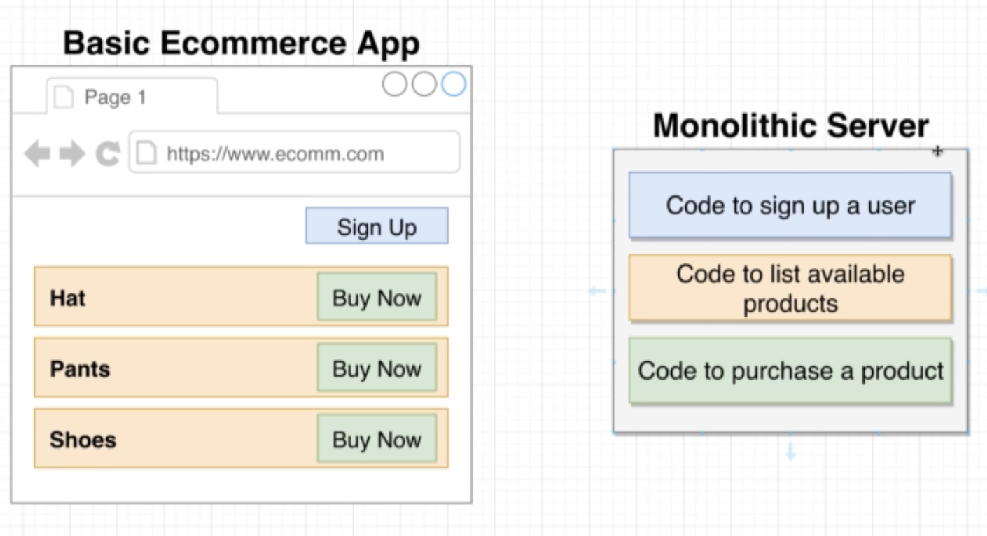

# Fundamental ideas around microservices

### What is a Microservice

모놀리틱 서버

* 하나의 코드베이스에서 애플리케이션에 필요한 모든 기능을 만든다
* 위의 사진에서 보이듯이 라우터, 미들웨어, 비즈니스 로직, 데이터베이스 접근 모두 하나의 애플리케이션 안에 구현되어 있다

마이크로서비스

* 하나의 단위(feature)에서 라우터, 미들웨어, 비즈니스 로직, 데이터베이스 접근을 실행할 수 있는 모든 기능을 포함하고 있다
* 이렇게 모든 피쳐들이 자기 완결적인 상태이므로 몇몇 피쳐가 장애로 인해 운용이 불가능해지더라도 서비스를 이용할 수 없는 상태는 되지 않는다

---

### Data in Microservices

마이크로서비스의 어려운 점
* 위의 설명만 들으면 마이크로서비스는 보다 장애에 쉽게 대응할 수 있는 장점만 있는 것으로 보인다
* 그러나 마이크로서비스는 각각의 피쳐가 모든 기능을 가지고 있으므로 하나의 피쳐에서 가진 데이터를 동기화하는 작업에 손이 많이 간다
* 예를 들어, 피쳐A는 자신이 가진 데이터베이스A에만 접근할 수 있다
* 그러나 피쳐B가 가진 데이터베이스B의 데이터가 필요한 경우는 항상 일어나기 마련이다

Database per service
* 그렇다면 이렇게 관리가 어려운데도 불구하고 각 피쳐마다 따로 데이터베이스를 관리하는 이유는 뭘까
* 우선, 앞서 말한 다른 서비스에 독립적이도록 각각의 서비스를 만들고 싶은 요구사항이 있다
  - 다른 서비스의 데이터베이스에 독립적이지 않으면 해당 데이터베이스에 장애가 생겼을 때 연달아 장애가 발생하는 문제점이 있기 때문이다
* 그리고 다른 데이터베이스의 스키마는 예상치못하게 변경될 수 있다
  - 예를 들어 User 정보를 가져오는 작업에 대해서 피쳐A는 응답결과물로서 유저명을 name으로 가정하고 나머지 코드를 작성했다고 하자
  - 그런데 피쳐B에서 어떤 이유로 name을 firstname으로 변경해 응답을 보냈다면 피쳐A의 코드에는 에러가 발생할 것이다
* 마지막으로 몇몇 서비스는 효율적인 데이터처리를 위해 서로 다른 타입의 데이터베이스를 사용할 수 있다

---

### Big Problems with Data

구체적인 예시를 하나 들어 마이크로서비스의 데이터 관리의 어려움을 알아보자
* 특정 유저가 상품리스트에서 특정 상품을 구매할 수 있는 커머스 애플리케이션이 있다고 가정해보자

* 필요한 기능은 유저 인증 기능, 상품 리스팅 기능, 상품 구매 기능이다

모놀리틱 방식의 해결

* 각각의 기능에 대응하는 코드를 하나의 서비스 안에 작성한다

* 그런 다음 작성된 각각의 기능들을 이용해 주문할 수 있도록 만들어준다
* 모놀리틱에서는 이렇게 각각의 기능들을 합쳐 실행하는 것이 전혀 어렵지 않다

마이크로서비스 방식의 해결

* 우선 유저, 상품, 주문에 대한 각각의 분리된 피쳐를 만든다

* 그런 다음 각각의 기능들을 합쳐 실행하기 위해 각 피쳐들의 데이터를 가져와야 한다
* 그러나 앞서 설명한대로 마이크로서비스에서는 하나의 피쳐가 다른 피쳐의 데이터베이스에 직접 접근해서는 안된다
* 이 점이 마이크로서비스의 가장 어려운 점이다
* 여기에 대한 두 가지 해결법을 알아볼 것이다

---

### Sync Communication Between Services

Sync와 Async

* 주의해야 할 점은 여기서 말하는 Sync와 Async는 자바스크립트에서 사용되는 개념과는 다르다

Sync communication

* 하나의 피쳐가 다른 피쳐와 직접 요청을 통해서 통신하는 방법이다
* 위 사진에서 보이듯이 피쳐 D가 개별 요청을 통해 필요한 각각의 기능들을 얻고있는 것을 볼 수 있다
* 한 피쳐가 다른 피쳐의 데이터베이스에 직접 접근하지 않으므로 룰을 위반하지 않고 있다

축소된 위험
* 위 설명으로만 보자면 룰을 위반하지 않으면서도 매우 명확한 방법으로 서비스를 만들 수 있을것처럼 보인다
* 그러나 여기에는 감춰진 어려운 문제들이 많이 있다

* 만약 피쳐A에 장애가 생긴다면 전체 작업을 총괄하는 피쳐D또한 작업을 제대로 처리해낼 수 없게된다
* 그리고 피쳐A, 피쳐C에는 시간이 20ms밖에 소요되지 않지만 피쳐B에 20s가 소요된다면 전체 작업을 총괄하는 피쳐D또한 20s이상이 걸리게 된다. 따라서 마이크로서비스에서는 전체 요청이 가장 느린 요청 만큼만 빠르다
* 또한 피쳐A가 의존하는 또다른 피쳐들(ex. 피쳐Q, 피쳐Z, 피쳐X)이 있을 수 있는데, 이중에서 오류가 발생하면 전체 요청에도 오류가 발생한다
* 이처럼 간결해보이는 해결책 안에는 많은 축소된 위험들이 있음을 인지해야 한다

---

### Event-Based Communication

이벤트 버스
* 각각의 피쳐들과 통신하는 지점으로서 이벤트가 발생하면 해당 이벤트에 맞게 특정 피쳐와 통신한다

* 유저를 요청하는 이벤트가 발생하면
* 이벤트 버스가 유저 피쳐와 통신하여 결과를 받아
* 해당 결과를 이벤트를 발생시킨 피쳐에 반환한다

---

### A Crazy way of Storing Data

Async방식으로 통신하는 두 번째 방법

* sync방식과 유사하게 일단 특정 피쳐에 대한 요청을 보낸다

* 요청을 받은 피쳐는 작업을 처리한 후 해당작업을 완료했다는 이벤트를 이벤트 버스에 보낸다

* 이벤트 버스는 요청을 발생시킨 피쳐에 이벤트 결과를 전송한다
* 이벤트 결과를 받은 피쳐는 데이터베이스에 결과를 저장한다

---

### Pros and Cons of Async Communication

Async 방식의 장점과 단점
* 장점
  - 의존성 감소 : 피쳐D가 다른 피쳐에 직접 통신을 하지 않으므로 다른 피쳐에 장애가 생겨도 피쳐D에는 전파되지 않는다
  - 빠른 속도 : 피쳐D는 데이터베이스를 직접 사용가능하므로 정보를 빠르게 얻을 수 있다
* 단점
  - 데이터 중복 : 피쳐A, B, C에 각각 인증, 상품, 주문에 대한 데이터가 필요한 동시에 피쳐D는 피쳐A, B, C의 모든 데이터가 필요하다. 따라서 데이터가 중복저장되는 단점이 있다
  - 학습 난이도 : 다른걸 다 떠나서 이런 구조로 데이터를 통신하기 위해 알아야 할 것들이 너무 많다